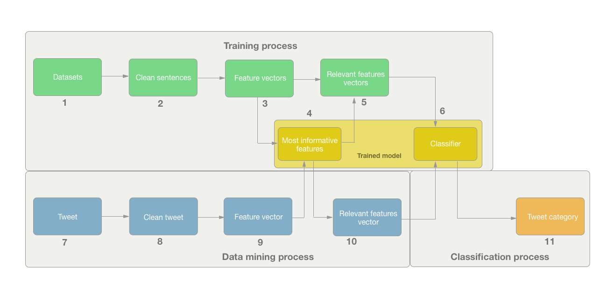
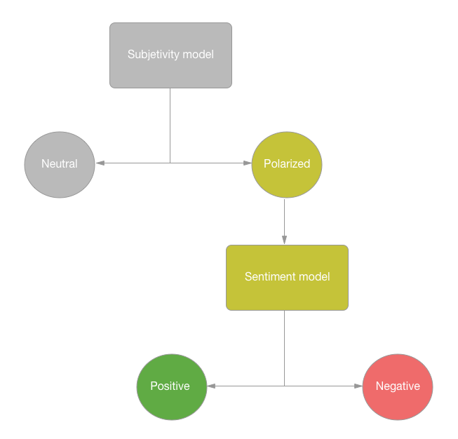

# Sentiment AI 📊

This project is based on the code used in my CS Bachelor's thesis research. Its main goal is to provide a simple way of training ML models to perform classification over tweets (using Twitter APIs). The models can be combined, using a JSON configuration file, in order to build a hierarchical classifier in the shape of a tree, where nodes are trained models and leaves are the different categories.<br>

<br>

Althought the models could be trained using datasets of very different nature, one of the most straightforward applications is to build a sentiment analysis hierarchical classifier. This particular classification example is hosted online using packages such as Flask and Gunicorn, to show the project potential capabilities.<br>

<br>

<b><a target="_blank" href="https://sentiment-ai-183521.appspot.com">Check out the Web Application here!</a></b>

<br>

## How does it work?

### General scheme:


First of all,  the ML models are trained:<br>
<b>1. Datasets:</b> they are text files containing one sentence per row.<br>
<b>2. Sentences cleaning:</b> tokenize, remove stopwords and extract the lemma of each word.<br>
<b>3. Features vectors:</b> build feature vectors using unigrams (words) and bigrams (pairs of words).<br>
<b>4. Features selection:</b> get the most informative features (input percentage) using chi-square test.<br>
<b>5. Filter features:</b> filter the current features leaving only the most informative ones.<br>
<b>6. Train classifier:</b> use Scikit-learn algorithms:<br>
- <i>Bernoulli Naïve Bayes.</i><br>
- <i>Logistic Regression.</i><br>
- <i>Linear Support Vector Machine.</i><br>
- <i>Random Forest (100 trees).</i><br>

<br>

Secondly, the tweets are extracted and processed:<br>
<b>7. Tweets extraction:</b> obtain tweets from Twitter APIs using Tweepy.<br>
<b>8. Tweets preprocessing:</b> tokenize, remove stopwords and extract the lemma of each word.<br>
<b>9. Features vectors:</b> build feature vectors using unigrams (words) and bigrams (pairs of words).<br>
<b>10. Filter features:</b> filter the current features leaving only the most informative ones.<br>

<br>

Finally, the classification is performed:<br>
<b>11. Classification:</b> the trained models classify the vector of features into one of the final categories.<br>

<br>

### Classification process:
The classification is performed in a hierarchical way. This means that the trained models are placed in the nodes of a tree, and depending on how the upper models classify a given piece of information, it will follow one branch or another.<br>

<br>

The advantages os this approach over a classic multi-label category are:<br>
- There could be different classifier algorithms as nodes, depending on which one perform best.<br>
- The set of most informative features is specific for each label-to-label differentiation.<br>

<br>

Following with the sentiment analysis case, there are 3 possible categories: neutral, positive and negative. They are represented as leaves in the classification tree, so once the assigned category to the text is one of those, the process is over. The classification tree would have this shape:<br>



In order to build a this custom classification tree, a JSON file with the following structure is required:

```json
    {
        "tree": {
            "clf_file": "subjetivity.pickle",
            "clf_object": null,
            "clf_children": {
                "polarized": {
                    "clf_file": "sentiment.pickle",
                    "clf_object": null,
                    "clf_children": {}
                }
            }
        },
        "colors": {
            "neutral": [0.6, 0.6, 0.6],
            "negative": [0.8, 0.0, 0.0],
            "positive": [0.0, 0.8, 0.0]
        }
    }
```

<br>


### Models evaluation:
The evaluation of the different models (defined by algorithm and percentage of informative features) is done using <b>10 Folds Cross Validation</b>. This method divides the datasets in 10 folds, performing 10 iterations where 9 are used for training and 1 for testing. Finally, the mean of the results is calculated.<br>

<br>

However, the evaluation procedure is not the only relevant factor to decide, choosing a good fitness metric is crucial to perform a good comparison. In this project, the evaluation metric is the <b>F-score</b>, which is better than common accuracy because it considers unbalance classification between categories (Explanation here).<br>

<br>

## What is in the repository?
The repository contains:

- <b>Evaluation folder:</b> contains a shell script to evaluate algorithms with different features percentages.<br>
- <b>Models folder:</b> contains the trained models.<br>
- <b>Profiles folder:</b> contrains configuration files:<br>
  - <b>Predicting folder:</b> contains files for building a hierarchical classifier from individual models.<br>
  - <b>Training folder:</b> contains files for training a model from specific datasets.<br>
- <b>Resources folder:</b><br>
  - <b>Datasets folder:</b> contains datasets to train models.<br>
  - <b>Images folder:</b> constains the images for this README.<br>
  - <b>Stopwords folder:</b> contains lists of language specific non-relevant words to filter.<br>
- <b>Source folder:</b> contains the code. The files could be grouped into different categories depending on their responsability:<br>
  - <b>Classification files:</b> using Scikit-learn<br>
    - <i> clf_hierarchy.py</i><br>
    - <i> clf_node.py</i><br>
  - <b>Data mining files:</b> using Tweepy<br>
    - <i> twitter_miner.py</i><br>
    - <i> twitter_stream.py</i><br>
  - <b>Data representation:</b> using Matplotlib<br>
    - <i> figures.py</i><br>
  - <b>Text_processing:<b> using NLTK<br>
    - <i>text_processing.py</i><br>

<br>

## Usage:

<b>DISCLAIMER:</b> Before using some of the following functionalities, you need to provide Twitter application and user keys in the <i>"twitter_keys.py"</i> file. They can be obtained by <b>creating a Twitter Application</b>.<br>

<br>

The main file from which all functionalities are called is <i>"main.py"</i>. The execution syntax is as follows:
```shell
$ python3 main.py <functionality> <args> 
```

Depending on the chosen functionality, the arguments are different. List of possible functionalities:

<br>

### Train a model:
Trains a models and saves it inside the <i>"models"</i> folder. The expected arguments are:<br>
- <b>-a algorithm:</b> {naive-bayes, logistic-regression, linear-svm, random-forest}.<br>
- <b>-f features percentage:</b> percentage of most informative features to keep.<br>
- <b>-l language:</b> language of the datasets sentences.<br>
- <b>-o output:</b> name of the output model.<br>
- <b>-p training profile:</b> JSON file specifying the datasets name and associated label. The datasets must be placed inside the <i>"profiles/training"</i> folder. Example:<br>

```json
[
   {
      "dataset_name": "neutral.txt",
      "dataset_label": "neutral"
   },
   {
      "dataset_name": "polarized.txt",
      "dataset_label": "polarized"
   }
]
```

Command line sxample:
```shell
$ ... main.py train_clf -a Logistic-Regression -f 2 -l english -o polarity.pickle -p polarity.json
```

<br>

### Search for tweets:
Retrieves tweets using Twitter Search API and saves them inside <i>resources/datasets</i>. The expected arguments are:<br>

- <b>-q query:</b> words or hashtags that the tweets must contain.<br>
- <b>-l language:</b> language of the retrieved tweets.<br>
- <b>-d search_depth:</b> number of tweets to retrieve.<br>
- <b>-o output:</b> name of the output file containing all the tweets.<br>

<br>

Command line example:
```shell
$ ... search_data -q "#excited OR #happy -filter:retweets" -l en -d 1000 -o pos_search.txt
```

<br>

### Predict user tweets:
Predicts the category of historic user tweets filtered by word using the Twitter REST API. The prediction is performed using a hierarchical classifier defined by a profile file inside <i>profile/predicting</i>. The expected arguments are:<br>

- <b>-u user:</b> user account name (without the '@').<br>
- <b>-w filter word:</b> word that has to be present in the retrieved tweets.<br>
- <b>-p profile:</b> JSON specifying the hierarhical classification tree (inside <i>profile/predicting</i>).<br>

<br>

Command line example:
```shell
$ ... predict_user -u david_cameron -w brexit -p sentiment.json
```

<br>

### Predict real-time tweets:
Predicts the category of real time tweets filtered by word and location using the Twitter Streaming API. The prediction is performed using a hierarchical classifier tree. The expected arguments are:<br>

- <b>-s buffer size:</b> number of tweets to represent in a live graph.<br>
- <b>-t filtered word:</b> word that has to be present in the retrieved tweets.<br>
- <b>-l language:</b> language of the retrieved tweets.<br>
- <b>-c coord_1 coord_2 coord_3 coord_4:</b> coordinates of the desired location.<br>
- <b>-p profile:</b> JSON specifying the hierarhical classification tree (inside <i>profile/predicting</i>)<br>

<br>

Command line example:
```shell
$ ... predict_stream -s 500 -t Trump -l en -c -122.75 36.8 -121.75 37.8 -p sentiment.json
```

<br>

## Requirements:
This project requires the Python 3.4 (or superior) 🐍 , as long as some additional packages such as:<br>
- <a href="https://matplotlib.org">Matplotlib</a>
- <a href="http://www.nltk.org">NLTK</a>
- <a href="http://www.numpy.org">Numpy</a>
- <a href="https://www.scipy.org">Scipy</a>
- <a href="http://scikit-learn.org/stable/">Scikit-learn</a>
- <a href="http://www.tweepy.org">Tweepy</a>
